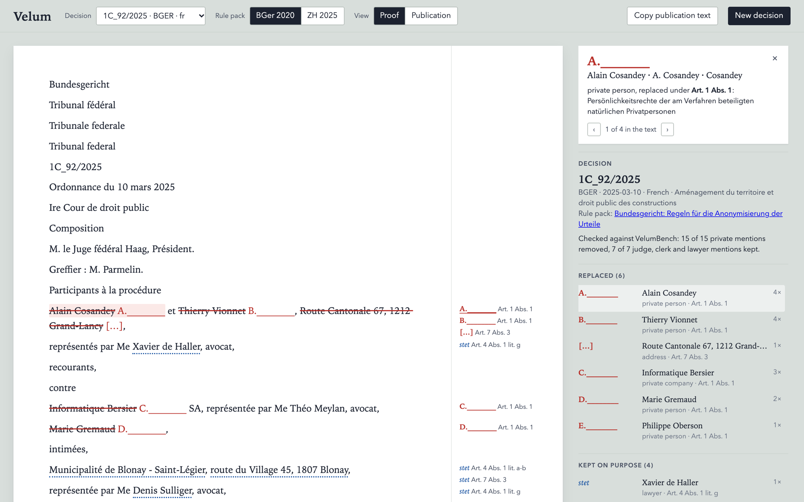
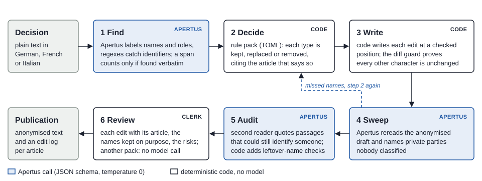

# Velum

Velum anonymises Swiss court decisions with Apertus. The model finds and classifies the names.
Code applies the court's own rules, cites the article behind every edit and proves that nothing
else in the text changed.

Built for Hack Apertus 2026, Track 2B (Own Project). Everything lives in [`track_2b/`](track_2b/):
the challenge text is [`track_2b/README.md`](track_2b/README.md), the write-up is
[`track_2b/technical_report.md`](track_2b/technical_report.md) (PDF: `track_2b/Calder_Report.pdf`).
Demo video (1:57): [youtu.be/9_h7k1gyfWY](https://youtu.be/9_h7k1gyfWY). Test set and run outputs:
[huggingface.co/datasets/jasonrobert/velumbench](https://huggingface.co/datasets/jasonrobert/velumbench).



## Why

Swiss courts must publish their decisions in anonymised form (Art. 27 para. 2 BGG); the Federal
Supreme Court alone issued 7,883 judgments in 2025. The rules are precise and differ between
courts: the Federal Supreme Court names judges, clerks, lawyers and court-appointed experts, while
the Zurich guide replaces all of them. Asking a language model to rewrite a decision misses names and
changes text nobody asked it to change. In my baseline, Apertus 70B removed 70.8% of the
identities and made 215 free-form changes outside the names in 45 of 60 decisions, among them a
cited case number and the first point of an operative part.

## Results

VelumBench puts invented identities where the courts put their placeholders, so the answer key is
exact. Test split: 537 held-out decisions from 8 courts in German, French and Italian, run once on
the final code with the CSCS endpoint.

| System | Decisions | Identities removed | Published names kept | Changes outside the names |
| --- | ---: | ---: | ---: | ---: |
| Rewrite, Apertus 70B | 60 | 70.8% | 95.7% | 215 |
| Velum, Apertus 70B | same 60 | **96.7%** | 97.2% | **0** |
| Velum, Apertus 70B | 537 | **89.4%** | 98.8% | **0** |
| Velum, Apertus 8B | 537 | 76.4% | 99.5% | 0 |
| Patterns only, no model | 537 | 4.6% | 100% | 0 |

The rewrite baseline runs on the 60 decisions short enough to rewrite in one reply (at most 15,000
characters, 20 per language). Velum with 70B used about 22,500 tokens per decision. Per-kind,
per-language and per-court numbers, the error analysis and the cost are in section 5 of the
[technical report](track_2b/technical_report.md); the raw outputs are in
[`track_2b/results/`](track_2b/results/).

## Run it

```bash
cd track_2b
export LLM_NAME=swiss-ai/Apertus-v1.5-70B
export LLM_BASE_URL=https://api.inference.cscs.ch/v1
export LLM_API_KEY=...            # your key for that endpoint
make run
```

`make run` builds the image and anonymises three bundled decisions (German, French, Italian; about
a minute with the 70B model). It prints each entity with its action and article and the
score against VelumBench, then serves the review page on http://localhost:8000. There you can
switch between the federal and the Zurich rules, read the second reader's notes, and paste a
decision of your own under "New decision".

| Command (in `track_2b/`) | What it does |
| --- | --- |
| `make run` | demo, then the review page on port 8000 |
| `make demo` | the demo in the terminal only |
| `make test` | unit tests of the deterministic parts, no model needed |
| `make bench ARGS="--split dev --limit 20"` | score Velum on VelumBench; results in `out/bench/` |
| `make airgapped` | Velum and Apertus 8B in llama.cpp on a network with no route out ([`docs/airgapped.md`](track_2b/docs/airgapped.md)) |

## How it works



1. **Find.** Apertus labels names and roles in windows of about 6,000 characters under a strict
   JSON schema; regular expressions catch identifiers. A mention counts only if it occurs verbatim.
2. **Decide.** A rule pack, one TOML file per court, maps each type to keep, replace or remove and
   to the article that says so.
3. **Write.** Code places every edit, and a diff guard checks that every other character of the
   decision is unchanged.
4. **Sweep.** Apertus rereads the anonymised draft and names private parties that nobody
   classified. It can only add redactions.
5. **Audit.** A second Apertus reader quotes passages that could still identify someone; code adds
   leftover-name and identifier checks.
6. **Review.** The clerk sees every edit with its article. Switching the rule pack needs no model
   call (18 ms for the decision in the demo video).

### Rule packs

| Category | Federal Supreme Court (2020 rules) | Zurich «ZHEntscheide» (2025 guide) |
| --- | --- | --- |
| Private person, private company | replace, Art. 1 Abs. 1 | replace, A.II.1 |
| Where a party lives or has its seat | replace, Art. 7 Abs. 1 | replace, A.II.5 lit. b |
| Street address of a party | remove, Art. 7 Abs. 3 | remove, A.I.4 |
| AHV number, IBAN, phone, e-mail, plate | remove, Art. 1 Abs. 1-2 | remove, A.II.4 |
| Lawyer | keep, Art. 4 Abs. 1 lit. g | replace, A.I.4 |
| Judge, clerk | keep, Art. 5 Abs. 1 | replace, A.I.4 |
| Court-appointed expert | keep, Art. 6 Abs. 1; replace in social insurance, Art. 6 Abs. 2 | replace, A.I.4 |
| Court, authority | keep, Art. 4 Abs. 1 lit. a | keep, A.I.3 |
| Municipality that is a party | keep, Art. 4 Abs. 1 lit. a-b | replace, A.I.2 |
| Occupation, birth year | keep, flagged by the audit | remove, A.II.2 and A.II.3 |

Another court is another TOML file in [`track_2b/src/velum/packs/`](track_2b/src/velum/packs/).

## Input and output

Track 2B prescribes no format, so Velum uses the simplest one a court already has: the decision as
plain text, or as JSON with `text`, `language` and `legal_area`.

```bash
cd track_2b/src            # Python 3.11 or newer, no packages to install
python3 -m velum anonymize path/to/decision.txt --pack bger-2020 --out out/
```

writes `decision.anonymized.txt` and `decision.velum.json`. The JSON holds every entity (names,
type, action, article, reason), every edit (position, original, replacement, article), the names
kept on purpose, the residual risks and the token usage per pass.

## Where it runs

| Setup | Apertus served by | How |
| --- | --- | --- |
| Hosted | CSCS endpoint (Swiss National Supercomputing Centre) | `make run` with the three variables |
| On-premise | any OpenAI-compatible server in the court's network (vLLM, SGLang, llama.cpp) | same, with your endpoint |
| Air-gapped | llama.cpp on the same machine, Docker network without a route out | `make airgapped` |

Velum itself is standard-library Python: no packages, no outside requests from the review page,
nothing downloaded at runtime.

## Repository

| Path | Contents |
| --- | --- |
| `track_2b/src/velum/` | the pipeline, rule packs, benchmark, review server and page |
| `track_2b/src/test_velum.py` | unit tests |
| `track_2b/data/` | VelumBench (dev 79, test 537 decisions) and the demo decisions; see [`data/README.md`](track_2b/data/README.md) |
| `track_2b/results/` | raw outputs and summaries of the benchmark runs in the report |
| `track_2b/docs/` | architecture diagram, air-gapped guide, review page screenshot |
| `track_2b/Makefile`, `Dockerfile`, `compose.airgapped.yml` | how to run it |

## Licence

Code: Apache-2.0 ([LICENSE](LICENSE)). Report and documentation: CC-BY-4.0. VelumBench annotations
and invented identities: CDLA-Permissive-2.0. Decision texts are official decisions and are not
protected by copyright (Art. 5 para. 1 let. c URG).
